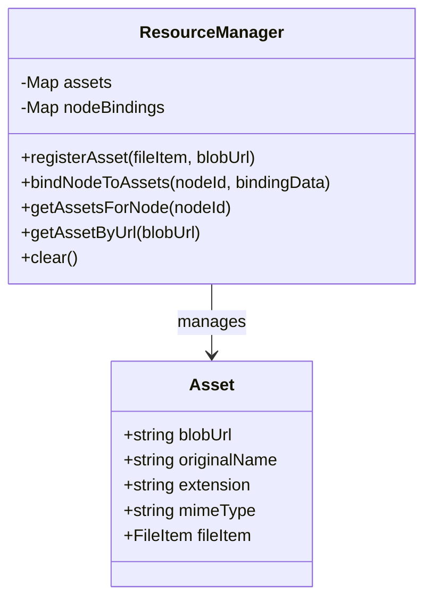

# 统一文件资源管理层（ResourceManager）架构设计方案

为了彻底整合各处散乱的文件处理逻辑、统一后缀名与 MIME 处理，并解除导出逻辑与 Pixi 节点内部复杂特有结构的直接耦合，我们拟设计并引入一个**统一的文件资源管理层**。

---

## 1. 核心设计：`ResourceManager`

我们将新建 [ResourceManager.js](file:///c:/Users/Administrator/Desktop/BaiNiaoGKD/appOriginal/FennecView/src/services/resources/ResourceManager.js) 作为统一管理中心。它将维护两个核心映射：
* **资源库 (Asset Registry)**：记录导入文件的物理信息，包括：
  * `id` / `blobUrl` (唯一标识符)
  * `originalName` (原始文件名)
  * `extension` (后缀名)
  * `mimeType` (MIME 类型)
  * `fileItem` / `blob` (源二进制对象，用于导出时获取二进制流)
* **绑定关系 (Bindings Map)**：记录场景中的渲染节点 (Node ID) 与资源 ID (blobUrl) 之间的依赖关系。例如：
  * 一个 Spine 节点绑定了 `skeleton`、`atlas` 和一组 `textures` 对应的资源 ID。



---

## 2. 详细重构路线

### 步骤 A：新建统一管理器 [ResourceManager.js](file:///c:/Users/Administrator/Desktop/BaiNiaoGKD/appOriginal/FennecView/src/services/resources/ResourceManager.js) [NEW]
* 实现 `registerAsset`、`bindNodeToAssets`、`getAssetsForNode` 等 API。
* 使用 `MimeUtil` 自动补齐所注册资源的 `mimeType` 与 `extension`。

### 步骤 B：导入阶段的资源注册与绑定
1. **基础文件项处理**：在 [FileItem.js](file:///c:/Users/Administrator/Desktop/BaiNiaoGKD/appOriginal/FennecView/src/services/import/models/FileItem.js) 的 `getBlobUrl` 阶段，自动将生成的 Blob URL 注册到 `ResourceManager`。
2. **场景节点生成绑定**：
   在各导入 Processor（Spine, Live2D, Image, Video, AnimatedSprite）将节点添加到场景后，调用 `resourceManager.bindNodeToAssets(node.id, ...)`。
   * **Spine 节点绑定**：
     ```javascript
     resourceManager.bindNodeToAssets(node.id, {
         type: 'spine',
         skeleton: skelBlobUrl,
         atlas: atlasBlobUrl,
         textures: Object.values(imageBlobMaps) // 依赖的纹理列表
     });
     ```
   * **Live2D 节点绑定**：
     ```javascript
     resourceManager.bindNodeToAssets(node.id, {
         type: 'live2d',
         modelJson: modelBlobUrl,
         associated: Object.values(pathMap) // 所有的 moc3, png 纹理等
     });
     ```

### 步骤 C：导出阶段的资源查询重构
修改 [nodeAssetCopier.js](file:///c:/Users/Administrator/Desktop/BaiNiaoGKD/appOriginal/FennecView/src/fennec-view/project/nodeAssetCopier.js)：
* 导出时，直接向 `ResourceManager` 申请资源：
  `const assets = resourceManager.getAssetsForNode(node.id);`
* 直接利用返回的原始文件名、MIME 类型和 Blob 流，调用 `addFileToZip` 进行导出，不再去读取节点内部晦涩的 `node.spineData.info.path` 等深层属性，从而实现彻底解耦！

---

## 3. 方案优势
* **一处解析，处处可用**：文件后缀、MIME、原始名称仅在导入注册时使用 `MimeUtil` 解析一次并记录，导出时直接复用。
* **节点纯净化**：PixiJS 渲染节点不再承载复杂的备份元数据，只需关注渲染和自身交互，数据依赖由 `ResourceManager` 统一打理。
* **单体与包大小解耦**：不再依赖具体节点的内部属性设计，新增节点类型（如音频等）时，导出代码无需修改，只需注册绑定即可。

---

## 4. 开放问题与反馈
> [!IMPORTANT]
> 1. 在保存/载入工程（.fv 文件）时，节点在重新载入后会分配新的 `node.id`，我们是否需要通过在工程序列化中持久化记录“节点 - 资源关联关系”，以保证重新加载后该绑定关系依然有效？（**推荐**：在工程保存和加载逻辑中，增加对 `ResourceManager` 的序列化/反序列化支持）。
> 2. 请确认以上设计方向是否完美契合您的预期。
