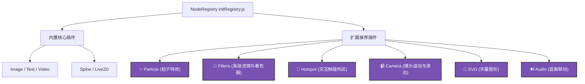

# FennecView 插件功能拓展推荐方案

本文档为 FennecView 项目的后续功能迭代与插件系统设计提供了拓展方案推荐。基于当前基于 PixiJS 节点树与动态模块化插件注册系统（`nodeRegistry`）的架构，可对以下类型的插件展开探索与开发。

---

## 🎨 插件架构图景



---

## 🛠 推荐拓展的六大核心插件类型

### 1. ✨ Particle (粒子氛围特效) 插件
* **应用场景**：为 Live2D/Spine 立绘增添极具氛围感的环境特写，如落樱、雪花、雨滴、火焰、闪烁星光、气泡浮动等。
* **技术方案**：使用官方的 `pixi-particles` 库或编写自定义片元着色器（Fragment Shader）。在 `src/plugins/particles` 下设计 `ParticleNode.js`。
* **可调属性**：
  * `particleType`: 粒子预设（雪花/落叶/荧光等）
  * `spawnRate`: 发射速率
  * `gravity`: 重力加速度（控制下落或漂浮速度）
  * `angle`: 发射/风向夹角

### 2. 🌈 Filters & Shaders (高级后期滤镜) 插件
* **应用场景**：为画布中的任意节点（甚至整个画布容器）应用游戏级的视觉处理。
* **技术方案**：集成 `pixi-filters` 库。
* **特效推荐**：
  * **Glow & Outline (外发光与描边)**：在选中模型时显示酷炫的光晕，极适合 UI 交互。
  * **Glitch & CRT (故障风与怀旧显示器)**：适合科技感、赛博朋克或恐怖悬疑风的演出。
  * **Godray (丁达尔圣光)**：营造阳光穿透雾气的华丽动态光晕。
  * **ColorAdjustment**：对饱和度、对比度、冷暖色调的实时微调。

### 3. 🎯 Hotspot (交互式触碰热区) 插件
* **应用场景**：Vtuber 或看板娘快速编辑器。用户可以在立绘的头部、胸口、手部拉取一个透明热区，当用户触碰该区域时，联动触发 Live2D 的特有动作（如摸头杀、拍手）、语音播放或弹出台词气泡。
* **技术方案**：通过挂载在父节点之上的 `PIXI.Polygon` 或 `PIXI.Circle` 进行碰撞检测。
* **可调属性**：
  * `targetArea`: 挂载的相对坐标与形状
  * `triggerEvent`: 绑定的事件类型（如 `click` / `hover`）
  * `action`: 联动命令（如播放指定动作 `motion: 'touch_head'`）

### 4. 📹 Camera (镜头运动与演出) 插件
* **应用场景**：制作多角色复杂的场景剧情演出。支持镜头平移、变焦拉近、旋转甚至镜头剧烈震动（Screen Shake）来模拟爆炸、受击等戏剧效果。
* **技术方案**：在画布的核心 Container 之上建立一个特殊的虚拟 Camera 包装器，通过缓动控制该容器的 x, y, scale 及 rotation。
* **可调属性**：
  * `lookAt`: 镜头焦点（绑定某图层节点）
  * `zoom`: 缩放因子
  * `shakeIntensity / shakeDuration`: 镜头震动幅度与持续时间

### 5. 📐 SVG Vector Graphics (矢量几何图形) 插件
* **应用场景**：绘制复杂的矢量路径、科技感边框、定制的 UI 图标等。相比当前的 `rect`（矩形），支持任意不规则复杂几何体的缩放，且放大无限倍不失真。
* **技术方案**：集成 `@pixi/graphics-svg` 库，支持直接加载 `.svg` 文本并将其转化为 PixiJS 图层对象。
* **可调属性**：`svgPath`（数据字符串）、`fillColor`、`lineWidth` 等。

### 6. 🔊 Audio (音轨与动作音效) 插件
* **应用场景**：背景音乐循环播放，以及与 Spine 骨骼事件或 Live2D 口型实时联动的语音音效。
* **技术方案**：利用 `pixi-sound` 或是 Web Audio API。
* **可调属性**：`volume`、`loop`、`spatialAudio`（根据节点 x/y 位置自动计算声相，实现 3D 左右声道环绕效果）。

---

## 💡 开发参考范式 (以 `Audio` 插件为例)

通过项目目前的插件机制，可按以下三个步骤实现新插件的加载与声明：

1. **新建节点控制器** `src/plugins/audio/AudioNode.js`：
   ```javascript
   import { node } from '@/fennec-view/nodes/BaseNode'
   
   export class audioNode extends node {
       type = 'audio'
       constructor(src, options = {}) {
           super()
           this.audio = new Audio(src)
           this.audio.loop = !!options.loop
           this.audio.volume = options.volume !== undefined ? options.volume : 0.8
       }
       play() { 
           this.audio.play() 
       }
       pause() { 
           this.audio.pause() 
       }
       // 补齐 getAttributes 及 getSerializableState 实现...
   }
   ```

2. **声明安装接口** `src/plugins/audio/index.js`：
   ```javascript
   import { audioNode } from './AudioNode'
   
   export default {
       install(registry) {
           registry.register('audio', audioNode)
       }
   }
   ```

3. **注册挂载** `src/plugins/initRegistry.js`：
   ```javascript
   import audioPlugin from './audio'
   
   // 在合适的位置安装
   audioPlugin.install(nodeRegistry)
   ```

---

## 🚀 进阶拓展方案推荐 (第二弹)

为了使 FennecView 在 Vtuber 互动展示、高保真游戏演出特效编辑以及多媒体创作沙盒方向达到行业一流水平，以下进阶插件也是极佳的发展方向：

### 7. ⚖️ Physics & Collision (物理刚体与碰撞) 插件
* **应用场景**：为场景中的普通图片、几何形体等节点加入重力、弹力与互相碰撞物理效果。例如，可以在立绘身上挂载摇晃的挂件、掉落碎屑，或者让角色站在绘制的地面平台上。
* **技术方案**：使用 `matter-js` 或 `Planck.js` 作为底层的 2D 物理引擎，将其坐标解算与 Pixi 节点的 `x, y, rotation` 属性绑定。
* **可调属性**：
  * `bodyType`: 刚体类型（静态 `static` / 动态 `dynamic`）
  * `mass`: 质量与重力系数
  * `restitution`: 弹性系数（控制撞击后的反弹力度）
  * `friction`: 表面摩擦力

### 8. 🍃 Micro Wind Force (环境微风物理风场) 插件
* **应用场景**：角色在闲置（Idle）或无动画播放时，为了使其显得生动，可以通过微风场使衣服、头发产生自然的随机小幅度晃动，或是鼠标快速扫过角色裙摆时产生惯性飘动。
* **技术方案**：编写基于正弦波或柏林噪波（Perlin Noise）的随时间推移算法，动态改变 Live2D 的头发物理参数（如 `ParamHairFront` 等）或者 Spine 的局部挂载点骨骼角度。
* **可调属性**：
  * `windScale`: 风力强度
  * `windDirection`: 风向夹角
  * `noiseFrequency`: 扰动频率（控制是柔风还是急风）

### 9. 🎨 Lottie Vector Animation (AE 复杂动效) 插件
* **应用场景**：在场景中播放极精细的矢量动效、复杂转场特效，或是加载高级动态 UI。设计师可直接使用 Adobe After Effects (AE) 制作特效并无缝导入。
* **技术方案**：集成 `pixi-lottie` 或 `@lottiefiles/lottie-player`，在画布中直接加载 AE 导出的 `.json` 动画文件。
* **可调属性**：`loop`（循环）、`playSpeed`（播放速度）、`frameRange`（指定帧区间播放）。

### 10. 🎙️ Lip-sync & Voice Controller (口型同步与麦克风监听) 插件
* **应用场景**：实现看板娘的实时“声音互动”。用户开启麦克风说话时，Spine 或 Live2D 模型的嘴巴会根据说话的音量、音调动态张合，达到音画合一的看板娘效果。
* **技术方案**：利用 HTML5 Web Audio API 的 `AnalyserNode` 进行实时麦克风电平捕获，通过频率/分贝大小动态映射模型嘴巴张合值（如 Live2D 的 `ParamMouthOpen`）。
* **可调属性**：
  * `micSelector`: 输入设备选择
  * `gain`: 声音敏感度增益
  * `noiseGate`: 噪音过滤门限

### 11. 📹 Screen Recording & Video/GIF Export (动态画布录制与透明表情包导出) 插件
* **应用场景**：在用户调节并编辑好一段 Live2D 视线跟随或者 Spine 特效后，支持直接把这段动态内容录制并输出为**带有透明通道的 WebM/MP4 视频**或 **动态 GIF 表情包**，便于二次创作分享。
* **技术方案**：利用浏览器 `canvas.captureStream()` 提取帧流，通过 `MediaRecorder` 实现 WebM 录制；在 JS 层引入 `gifshot` 或 `webm-writer` 执行多帧编码压缩。
* **可调属性**：
  * `exportFps`: 导出帧率 (30 / 60 FPS)
  * `transparentBackground`: 是否保留透明通道
  * `gifDither`: GIF 抖动画质参数
